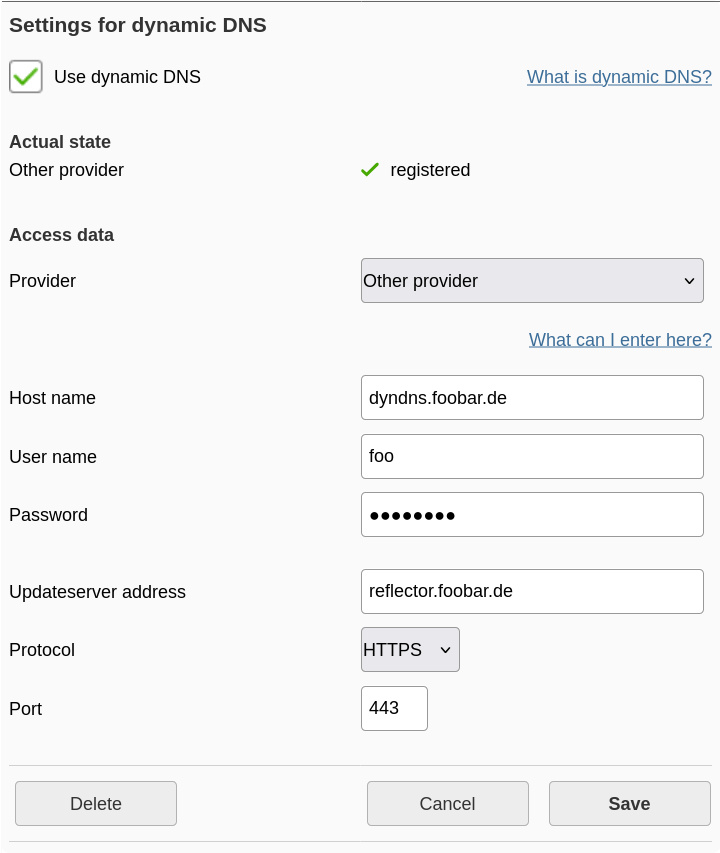

<div align="center">
  
  <h1>Speedport custom DynDNS</h1>
</div>

Have you ever wanted to use some saner DynDNS provider than the three or four
supported by the Speedport "Smart" 4? Me too!

This repository contains a small rust server, also available as a docker image,
that allows you to do just that. It acts as a DynDNS v2 server which you can
enter as "Custom DynDNS" and then forwards all requests to cloudflare. Other
providers are also possible, I just only needed cloudflare so far 🐞

## In Action

For our small example, assume that your cloudflare zone is `foobar.de` (the
`ORIGIN` env var) and you want `dyndns.foobar.de` to point to your speedport,
while your reflector instance is running on `reflector.foobar.de` and has HTTPS
set up.

| Field                | General meaning/value                          | In our example      |
|----------------------|------------------------------------------------|---------------------|
| Provider             | Other provider                                 | Other provider      |
| Host name            | The fully qualified name of your dyndns domain | dyndns.foobar.de    |
| User name            | Something random, it is ignored                | foo                 |
| Password             | The password from the `PASSWORD` env var       | `<password>`        |
| Updateserver address | The domain your reflector is running on        | reflector.foobar.de |
| Protocol             | HTTP or HTTPS, if you have it                  | HTTPS               |
| Port                 | The port your reflector is running on          | 443                 |

---
<br>

Consequently, the speedport interface should look like this if everything works
:)

<div align="center">
  </img>
</div>

## Installation

You can run this project via Nix, Docker or just compile it yourself.

**With docker**:  
```yaml
services:
  speedport-dyndns-reflector:
    image: "ghcr.io/i-al-istannen/speedport-custom-dyndns:master"
    restart: always
    environment:
      CLOUDFLARE_API_TOKEN: "cloudflare token"
      PASSWORD: "used as the password in the speedport"
      ORIGIN: "your cloudflare zone domain, e.g. foobar.de"
```

**With nix**:  
`nix run github:i-al-istannen/speedport-custom-dyndns`

**From source** (you need cargo installed):  
```sh
git clone https://github.com/I-Al-Istannen/speedport-custom-dyndns
cd speedport-custom-dyndns
cargo build --release
# you find the binaries in target/
```
